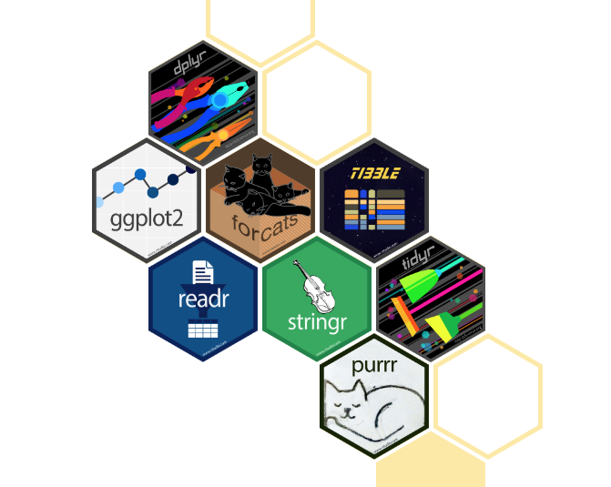

```{r setup, include=FALSE}
knitr::opts_chunk$set(echo = TRUE,
                      eval = FALSE,
                      message=FALSE,
                      error=FALSE)
knitr::opts_knit$set(root.dir = '../')
library(webexercises)
```


#### Prepare environment - pacman

A good first thing to do when running any R script, is to set your working environment and load any libraries you may need. A handy tool for loading packages is [pacman](http://trinker.github.io/pacman_dev/). This package conveniently loads libraries, installs libraries that are not installed, including bioconductor packages!

```{r eval=TRUE}
# set working directory
setwd("~/Documents/git_projects/PoE23_rnaseq")
#setwd("~/Documents/teaching/principals_of_evolution23/PoE23_rnaseq")


# install pacman if not already installed
if (!require("pacman")) install.packages("pacman")

# use pacman to load libraries
pacman::p_load(tidyverse, DESeq2)
```


## Background

In this brief practical, we want to make sure we are all on the same page when it comes to the tidyverse and biocodunctor.

## The Tidyverse

> _Question:_ What is the Tidyverse?   
 
 `r hide("Show Answer")`


 

 * [A collection of R packages](https://www.tidyverse.org/)
 * The packages are focused on data science and they share an underlying grammar and design. In other words, they play well together!

`r unhide()`

Efficient data manipulation and visualization becomes increasingly important when working with large datasets. In genomics, we are often working with 10s of thousands or 100s of thousands of lines of data that need to be manipulated in R.   

### Installing and using the tidyverse

```{r}
p_load(tidyverse)
```

You should see that a call to load tidyverse essentially just loads a number of "core" packages. 

### My favorite functions

1. The pipe! 

Essentially, pipes (`%>%` or `|>`) are special functions that allow you to take the output of one operation and use it as the input of another operation. Here is a very simple example:

```{r}
# take a look at this dataset
mpg

# we can use `nrow()` to count how many rows are in this table like so:
nrow(mpg)

# we can do the same operation using a pipe, like this:
mpg %>% nrow()
```

With this basic example, it is hard to justify using the pipe, but lets crank it up a knotch.

```{r}
# say we want to count how many rows have "audi" as the manufaturer are in this dataset. We could  do a series of individual operations, always saving the output like so: 
#1. subset all rows with audi
audi<-subset(mpg, manufacturer=="audi")

#2. count rows
nrow(audi)

# we can of course put it all together as a series of nested functions like this:
nrow(subset(mpg, manufacturer=="audi"))

# you can see however how this would get quite confusing with every level of operation you add. Pipes make this much cleaner:
mpg %>%
  subset(manufacturer=="audi") %>%
  nrow()
```

Throughout this course we will be using pipes extensively. Hopefully I will convince you of their utility for keeping code tidy and removing reduncancy.

2. Select, filter and arrange!

If you are mostly working with base R, then you will most likely rely heavily on `subset()`, Boolean operators `TRUE/FALSE` and row and column indices `[row-number,column-number]` to filter, select and sort your data. The tidyverse can do much of the same, but with a more intuitive set of functions.

```{r}
## lets subset the same dataset to only include audi (`filter()` rows), and only the manufacturer, model and year columns (`select()` columns). Then we can sort (`arrange()`) it by the year.

mpg %>%
  filter(manufacturer=="audi") %>%
  select(manufacturer, model, year) %>%
  arrange(year)
```

3. Mutate!

Creating a new variable in the tidyverse uses the `mutate()` function.

```{r}
# lets calculate an average fuel consumption for city and highway driving
mpg %>%
  mutate(avg_consumption=(cty+hwy)/2)
```

4. Grouping and summarizing!

Summarizing data in columns is achieved like so:

```{r}
# mean manufacturing year:
mpg %>%
  summarise(mean=mean(year))

# it is much more powerful however... we could for example:

# get the means of all numeric variables
mpg %>%
  summarise_if(is.numeric, mean)

# or get multiple summary statistics at once:

mpg %>%
  summarise(mean_cty=mean(cty),
            sd_cty=sd(cty))
```

This function is really useful when you combine it with `group_by()`. This does exactly what it says on the box: it groups data by a specified variable:

```{r}
# look what happens when we group by manufacturer:
mpg %>%
  group_by(manufacturer)
## you should see that the table header now contains the grouping information (manufacturer[15])

# and now, we can get summary statistics per group:
mpg %>%
  group_by(manufacturer) %>%
  summarise_if(is.numeric, mean)

```

5. left join, right join, inner join, full join!

Any SQL people out there? Often, we have more than one dataset or table and we want to join them based on a reference variable. These "join" operations can go in different directions, depending on which table you want to complete:  

  
You will most likely use `left_join()` most, where you wish to pull additional data from a second table into your first/primary table
```{r}
# imagine the mpg data set was our most complete data set, but we were working with a list of only manual cars and their manufacturing details, and we wanted to find out what millage these cars have:

# our manual data subset
df1<-mpg %>%
  select(-c(cty, hwy)) %>%
  filter(str_detect(trans, "manual"))
df1

# now we can join the two, to get the millage information for just these manual cars
df1 %>%
  left_join(mpg)

```


6. Pivot longer and wider

When one variable is nested within another variable, this information can be stored as either a "wide" table, or a "long" table. (Think about multiple species in a genus, or multiple morphological measurements taken from a single animal).


One way of thinking about it is that wide tables have a single ID column and then many value columns, whereas a long table has many ID columns and only a single value column. Coming from Excel, and base R, we are probably more familiar with wide tables, but the tidyverse really likes long tables. To switch between them, we use `pivot_longer()` and `pivot_wider()`.
  
Lets take a look at another very popular dataset, the `iris dataset`.

```{r}
iris %>% as_tibble()
```


> _Question:_ Is the iris dataset long or wide?   
 
 `r hide("Show Answer")`

 * The iris dataset is a typical wide dataset, where each trait is its own variable

`r unhide()`

```{r}
## lets reshape it!
iris %>%
  pivot_longer(-Species, names_to = "trait", values_to = "length")
```

Although this may seem trivial or even unnecessary at first glance, it is a hugely important data transformation technique. 

### Visualizing data with ggplot2

A package of the tidverse that many of you may know already is `ggplot2`.  To build plots using ggplot takes three general steps.

1. Create a new ggplot object

```{r}
# lets look at an internal dataset on car manufacturing information
mpg

# to build a plot we have to define two basic aspects
# 1. what is our dataset? - defined by  "data="
# 2. what variables do we want to plot? - defined by mapping the aesthetics, or "mapping=aes()"
ggplot(data=mpg,
       mapping=aes(x=displ, y=hwy))
```

2. Add plot layers

Once the plot as been created, you can add any plot layer you like, using `geoms`. For example, the x and y data as points:

```{r}
ggplot(data=mpg,
       mapping=aes(x=displ, y=hwy)) +
  geom_point()
```

Different geoms allow for different data visualisation

```{r}
# line graph
ggplot(data=mpg,
       mapping=aes(x=displ, y=hwy)) +
  geom_line()

# boxplot (categorical x axis)
ggplot(data=mpg,
       mapping=aes(x=manufacturer, y=hwy)) +
  geom_boxplot()

# boxplot (categorical x axis)
ggplot(data=mpg,
       mapping=aes(x=hwy)) +
  geom_histogram()
```


3. Styling visualizations

Different styling can be added at different parts of the build.

  3.1 themes and colour

Adding a fixed colour is done outside the aes()
```{r}
ggplot(data=mpg,
       mapping=aes(x=manufacturer, y=hwy)) +
  geom_boxplot(fill="blue")
```

Adding a conditional colour is done insidee the aes()
```{r}
ggplot(data=mpg,
       mapping=aes(x=manufacturer, y=hwy, fill=manufacturer)) +
  geom_boxplot()
```

General theme elements can be manipulated both with canned theme functions, or manually

```{r}
ggplot(data=mpg,
       mapping=aes(x=manufacturer, y=hwy, fill=manufacturer)) +
  geom_boxplot() +
  ## apply a canned theme
  theme_classic() +
  ## edit the theme by e.g. removing the legend
  theme(legend.position = "none")
```


### Final comments:

* Switching to the tidyverse can be a little daunting at first and may seem redundant. Many things can be done in base R. However, it is a powerful too for complex data organization and manipulation.
* Learn by doing! As with any programming language, the best way to learn is to just get your hands dirty. Your regular google search should be "how do i ________ using the tidyverse?".

