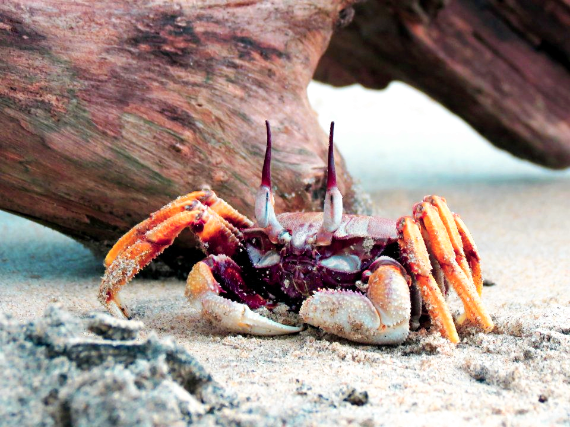

## Diseña tu propio experimento!

Descubrimos una especie de cangrejo que vive en la zona intermareal de un archipiélago en la costa de Nueva Zelanda. Óptimamente prefieren vivir en el océano, pero ahí se pueden ver expuestos a depredación por focas. Algunas de las islas de este archipiélago de hecho cuentan con grandes poblaciones de focas. En estas islas los cangrejos presentan un fenotipo particular, que parece reducir el riesgo de depredación: desarrollan unos caparazones más gruesos y pasan a ocupar pozas de la zona intermareal más próxima a tierra. Estas pozas son por lo general más cálidas, tienen menos oxígeno y mayor salinidad que el océano.

Tu eres parte de un equipo de investigación que está estudiando este sistema y eres responsable de diseñar y llevar a cabo los análisis -ómicos.   Quieres saber en qué difieren los cangrejos oceánicos de los de las pozas intermareales, pero no cuentas con un genoma de referencia para la especie.

Diseña un plan de trabajo para comprender al menos uno de los posibles mecanismos moleculares que puedan subyacer a las diferencias fenotípicas (comportamiento, morfología, fisiología) entre ambos tipos de cangrejos.

Algunas cosas sobre las que recapacitar (aunque no exclusivamente) serían:

* ¿Qué muestras biológicas colectarías? ¿Por qué?
* ¿Cuantas replicas y de qué condiciones escogerías?
* ¿Cuáles serían las fases principales del estudio y del análisis? ¿Que tipo de secuenciación escogerías? ¿Que tipo de análisis? ¿Qué software usarías? ¿Por qué?
* Una vez tomados y analizados los datos, toca presentarlos (congresos, publicaciones, prensa). ¿Qué tipo de figuras escogerías para representar los datos?
